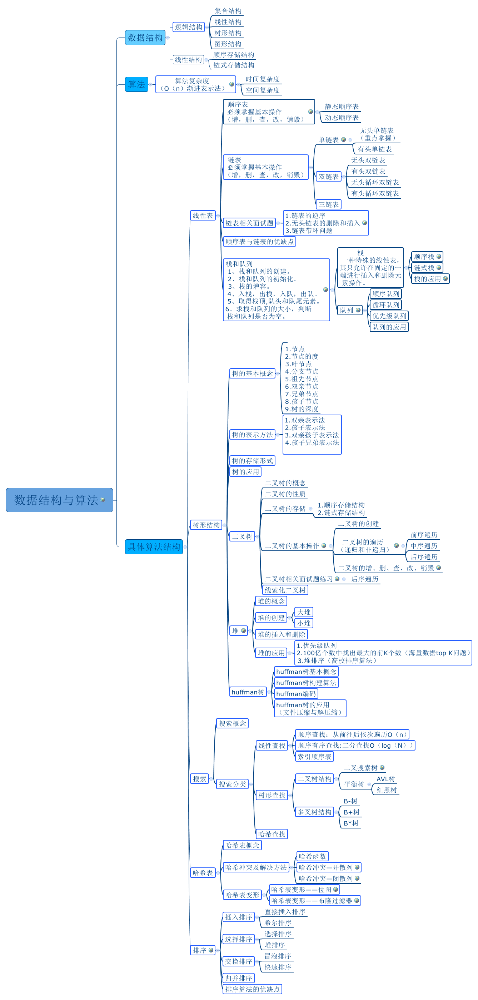
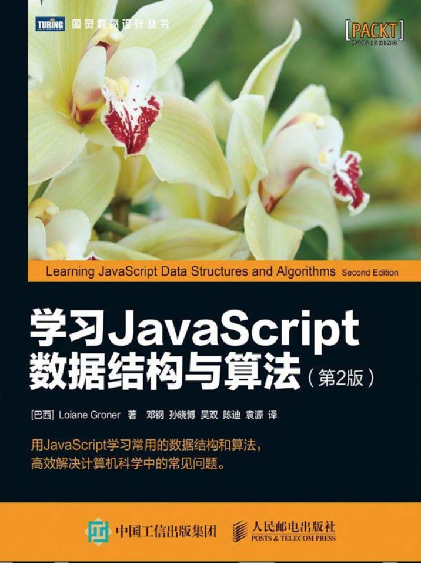
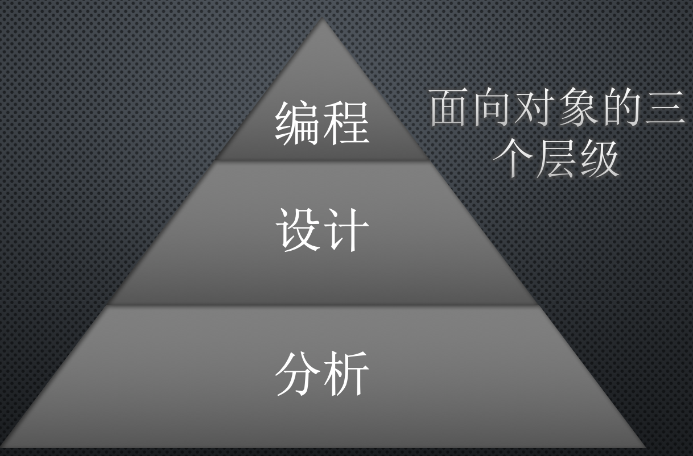
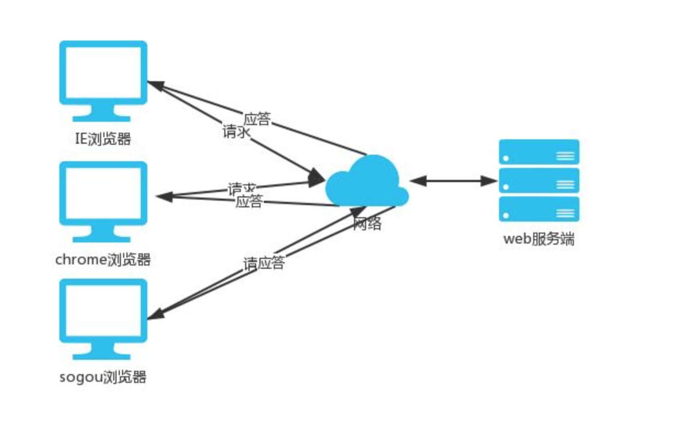
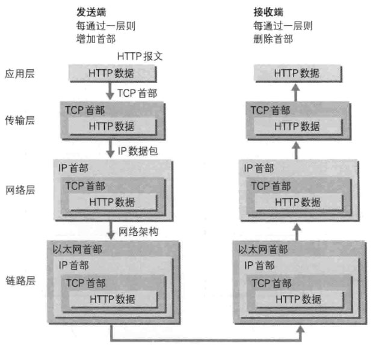

# 前端面试指南

本仓库会以面试为切入点，深入解析前端知识点。本篇文章为前端面试总论。
<b>重点提示，本文不是面试大全，文章内容旨在告诉读者应该从哪些方面加强基础、提升技能，提升面试成功率。</b>

## 1.0 前端界定

由于技术的发展，前端的基本概念和外延在不断的发生变化，诸如大前端、全栈开发等扩展概念也逐渐等同于前端开发。另外一些新生技术体系，比如小程序开发，因为借鉴浏览器模式而来，通常由前端开发者负责此类应用开发，也被划归为前端技术之一。Javascript从Node.js 诞生之时便跨入了后端开发范畴，但是由于Node.js 开发者多为前端跨域而来，前端开发者自身的技能领域扩展了，于是有了全栈的概念。全栈又继续扩展为整个web前后端开发领域，开发语言也扩展为能进行web后台开发的所有语言。随着浏览器功能的持续增强，比如3D，多线程，WebAssembly等技术的推进，由于现有前端开发者的知识体系受限，其他专业领域的开发者也转入前端，基于浏览器做图形图像、大型游戏，甚至人工智能的开发。C++、Go、C#等一大批以往只能在传统桌面领域和后端开发领域应用的语言也走进了基于浏览器的前端开发领域。前端正面临新一轮的变革。

在这场变革尘埃落定之前，至少在当下，企业对于前端开发者要求还是比较一致的，有如下特征：

1. 开发语言以Javascript、Html、CSS为基础及核心。JavaScript同时考察es5及es6，Html面向Html5，CSS面向CSS3。
2. 宿主环境以浏览器为主，考察基于浏览器的Web应用开发技能和基本原理。标准Web浏览器包括桌面端和移动端。
3. 基于开源浏览器内核开发的PC桌面应用或者移动端应用开发框架的使用和理解。类浏览器开发模式的移动端应用开发框架的使用。比如Electron，移动端的混合开发，微信小程序开发等。
4. 流行的Web应用开发框架和类库的考察。比如React和Vue。
5. 细分出来的专业领域。比如数据可视化，游戏开发会重点考察2d，3d开发基础，图形图像、动画等内容。
6. Node.js考察的权重在日益增强。
7. 随着前端应用的复杂度越来越高，前端工程化的重要性日益凸显。

从各大招聘网站的前端招聘需求来看，面向浏览器的web应用开发仍然是主流。因为掌握面向浏览器的web应用开发的基础知识和技能，可以很容易迁移到其他前端开发领域中，所以基于此领域的面试考察为重中之重。基于此，本面试指导以面向浏览器的web应用开发为核心依据。

## 1.1 前端知识体系

前端知识体系日益庞杂，但是以JavaScript、Html和CSS构成的核心体系的地位，目前没有被动摇，核心应用场景仍然是面向数据展现和基本功能交互。要理清整个知识体系，第一需要从计算机技术体系的角度看前端开发，第二需要从Web应用的场景入手。接下来我们从前端核心概念到大前端技术栈的方向扩展开来，聊一聊做为一个前端你需要掌握或者了解的内容。这里我只告诉你，你需要了解什么，不会讲这些知识点的具体内容。

### 1.1.1 通用编程基础

由于历史原因，最很久很久以前，在国内并没有专职的前端开发人员，再后来前端开发人员也只是会切图写个样式而已，凡是和编程相关的工作都统一由后端来做。所以前端程序员在很长一段时间内都是受鄙视的，我们是不会编程的程序员。

这种现状随着技术的发展，前端程序员的努力，越变越好，同时企业在面试过程中向后端程序员看齐，在基本的数据结构和算法，面向对象编程基础方面考察的越来越多。

基本的数据结构和算法方面，需要我们回归到大学的数据结构算法课，课上讲的内容已经足够了，前端面试考察的内容只会更少不会更多。下面这幅图，罗列了数据结构和算法的基本内容（图片来源：https://www.cnblogs.com/zhonglongbo/p/8606920.html）：

基本理论可以参考的书籍很多，这里就不推荐了。具体到前端，需要用JavaScript来实现这些数据结构和算法，由于JavaScript语言特性，在实现上和c/c++或者Java这些静态语言还是有差别的。这里推荐一本书：《学习JavaScript数据结构与算法》

这本书首先介绍了JavaScript 语言的基础知识以及ES6 和ES7 中引入的新功能，接下来讨论了数组、栈、队列、链表、集合、字典、散列表、树、图等数据结构，之后探讨了各种排序和搜索算法，包括冒泡排序、选择排序、插入排序、归并排序、快速排序、堆排序、计数排序、桶排序、基数排序、顺序搜索、二分搜索，然后介绍了动态规划和贪心算法等常用的高-级算法以及函数式编程，最后还介绍了如何计算算法的复杂度。

面向对象方面，会分两个方向，一个是面向对象基本原则和设计模式的理论，另一个是如何使用Ja
vascript来实现面向对象编程。大多数面试官会将面试问题转移到JavaScript原型相关的语言特性考察上，实际上舍本逐末。 “对面向对象的理解”这样的问题是可以区分出面试者能力层级的经典问题，直接考察面试者的业务能力，业务经验，编程水平和架构能力。

面向对象分三个层级：面向对象分析，面向对象设计和面向对象编程。

如上图，分析是设计的基础，设计是编程（具体编码实现）的基础。分析和设计体现的是面向对象的精髓。如果能结合实践经验从这三个层面来阐述面向对象的问题的面试者，我会认为他是有架构经验和架构能力的，具备面试架构师的资格。如果只是从JavaScript如何模拟类行为，讲解原型链相关知识点的，只能证明语言特性掌握的好，不代表面向对象思想和编程经验具备，也就是中级以上程序员的的标准。下面我简单阐述这三个层面要做的工作。

面向对象分析，是在我们拿到业务需求之后，先对需求做基本的理解，然后划分领域和模块，细分角色和行为，确立业务边界和流程。在小型应用和简单页面开发，这方面的重要性体现的不是很明显，但是面向一个复杂的业务系统，尤其是从头构建的时候，面向对象分析会直接影响技术选型和架构模式。

面向对象设计是在面向对象分析基础上，梳理的业务模型进行编程层面的抽象。用接口，类来表示领域对象，确立类与类之间的关系。划分分层结构，确定层与层，模块与模块间的通信方式，进而确定技术选型。基于面向对象设计的基本原则，确定接口，确定哪些类需要单例等等。

面向对象编程阶段是编码实现阶段，在这个阶段将设计阶段的抽象结果变为现实。这一阶段主要完成两个任务，一个是设计实现，一个是功能实现。设计实现是要决定使用什么样的设计模式，什么样的框架和类库来实现面向对象设计的要求，比如IoC容器的选择；如何实现类，方法的划分等等。功能实现是具体的逻辑实现和相关技术点的实现。

关于分析与设计，推荐大家读一读《领域驱动设计-软件核心复杂性应对之道》一书。

大部分前端工程师可能对这些内容很陌生，实际上这是面向对象的基本功，你想做高级开发或者架构师，或者团队的领导者必须站在业务的角度去深入到代码。 这块就不再展开了，做面向对象设计编码需要了解面向对象编程的基本原则和设计模式。七个基本原则需要你能倒背如流，设计模式推荐大家阅读《JavaScript设计模式》一书，JavaScript的语言特性在设计模式的实现细节方面和其他语言差别很大。

通用基础不止这些，如果你有余力，一定要补足计算机专业大学里的基础课程，每一个基础都有助于你在更接近本质的层面上去理解前端的各项技术，尤其是浏览器原理。 下面我们从前端业务场景的角度来分析和拆分知识体系。

### 1.1.2 HTTP协议

绝大多数情况下，浏览器的访问的页面内容来自于远端服务器的响应，我们称这种模式为B/S模式。

浏览器和web应用服务器之间的交互过程，遵守Http协议。没有HTTP协议就没有web，所以作为Web开发者，需要把Http协议作为底层基础来学习。

（下面关于Http协议内容的图例来自《图解Http》一书）
首先我们需要了解TCP/IP体系的基本内容，知道HTTP在7层或者4层模型中的位置，能够从数据交互的角度理清楚一个Http协议的整个过程。例如Http的数据报文结构：

需要理解Http协议的核心特性是什么样的，比如无状态，但是在无状态的特征下Web应用是如何实现状态管理的，这就引出了Cookie，Session这些经典问题。

Http报文结构

