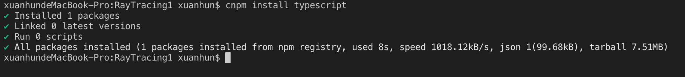
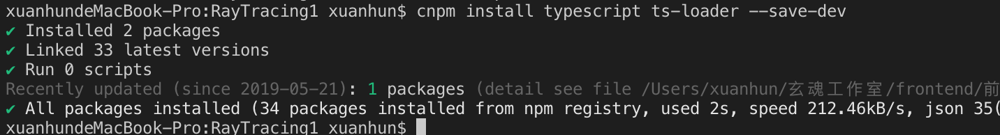

参考资料：

https://zhuanlan.zhihu.com/p/55518151

https://www.scratchapixel.com/lessons/3d-basic-rendering/rasterization-practical-implementation

https://github.com/ssloy/tinyrenderer/wiki

https://tayfunkayhan.wordpress.com/2018/11/24/rasterization-in-one-weekend-part-i/

https://www.gabrielgambetta.com/computer-graphics-from-scratch/introduction.html

https://drive.google.com/drive/folders/14yayBb9XiL16lmuhbYhhvea8mKUUK77W

https://zhuanlan.zhihu.com/c_189375388

https://zhuanlan.zhihu.com/p/36394396

http://in1weekend.blogspot.com/2016/01/ray-tracing-in-one-weekend.html

https://zhuanlan.zhihu.com/p/36238483

https://zhuanlan.zhihu.com/c_189375388

# 第一章 搭建开发环境


## 1.1 安装TypeScript

```
cnpm install typescript
```


添加tsconfig.json

```json
{
    "compilerOptions": {
      "module": "commonjs",
      "target": "es6",
      "sourceMap": true
    },
    "exclude": [
      "node_modules"
    ]
  }
```

## Install webpack and ts dependencies

```
cnpm install webpack webpack-cli ts-loader --save-dev
```


添加 webpack.config.js

